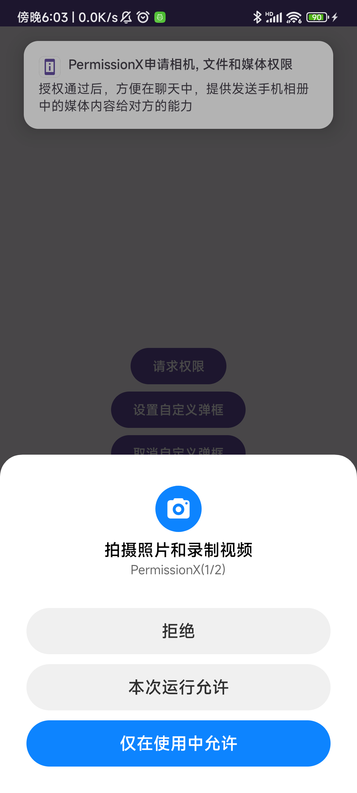
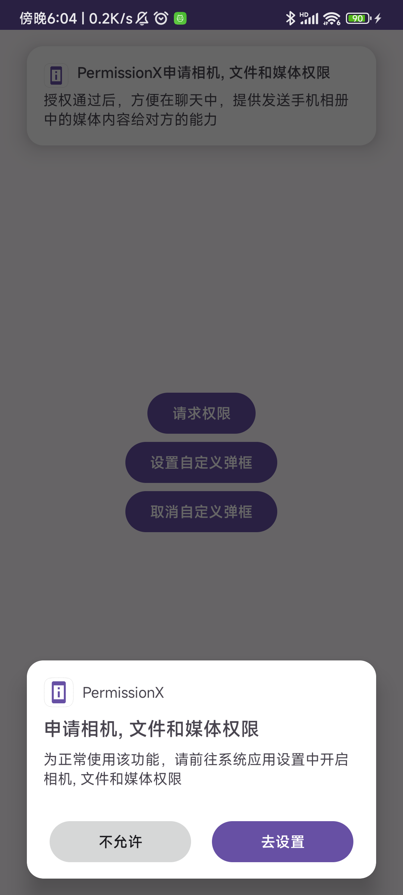

# PermissionX

[](https://jitpack.io/#com.gitee.liu_wanshun/PermissionX)

	一个简单易用的Android 运行时权限请求框架。

## Gradle

**1.** 在项目根目录下的 `build.gradle` 文件中加入

```groovy
allprojects {
	repositories {
		 maven { url = "https://jitpack.io" }
	}
}
```

**2.** 在 app 模块`build.gradle`添加依赖

```groovy
dependencies {
  //仅支持AndroidX
    implementation("com.gitee.liu_wanshun:PermissionX:latest_version")
}
```

## 用法

**1.** 权限请求

  ```kotlin
 PermissionX.with(this)
                .permissions(Manifest.permission.CAMERA, Manifest.permission.READ_EXTERNAL_STORAGE)
                .onRequestRationale("授权通过后，方便在聊天中，提供发送手机相册中的媒体内容给对方的能力")
                .request { result ->
                    Log.e("ssss", "request   onResult: isAllGranted  ->  ${result.isAllGranted}")
                    Log.e("ssss", "request   onResult: Granted -> ${result.getGrantedList()}")
                    Log.e("ssss", "request   onResult: Denied  -> ${result.getDeniedList()}")
                }
  ```

2.自定义弹框样式

```kotlin

//设置自定义弹框
PermissionX.setRationaleFactory(CustomRationaleFactory())

//取消设置自定义弹框（使用默认弹框）
PermissionX.setRationaleFactory(null)
```

**请求时效果 ：**


**永久拒绝时效果：**


## 更新日志

[Releases](https://gitee.com/liu_wanshun/PermissionX/releases)

## License

```
Copyright (C) 2021. liuwanshun

Licensed under the Apache License, Version 2.0 (the "License");
you may not use this file except in compliance with the License.
You may obtain a copy of the License at

   http://www.apache.org/licenses/LICENSE-2.0

Unless required by applicable law or agreed to in writing, software
distributed under the License is distributed on an "AS IS" BASIS,
WITHOUT WARRANTIES OR CONDITIONS OF ANY KIND, either express or implied.
See the License for the specific language governing permissions and
limitations under the License.
```
